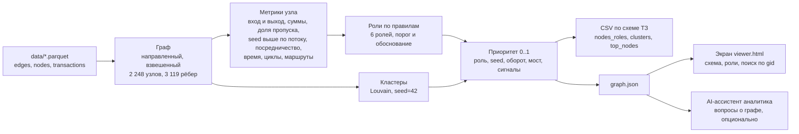

# Граф денег: кого проверять первым

**HackAlem AI, трек «Финансы», кейс Freedom.** Команда `git push --force`.

Инструмент для AML-аналитика банка. На вход: выгрузка исходящих переводов 81 известного участника
на 4 колена (три parquet-файла). На выход: роль, кластер и приоритет для каждого из 2 248 клиентов,
три CSV по схеме ТЗ и экран со схемой сети. Главный вопрос аналитика: **«кого из 2 248 смотреть первым и почему»**.

Все выводы сформулированы как **гипотезы для проверки** («признаки консолидации»), а не как утверждения о виновности.

**Посмотреть без установки: https://graf-deneg.vercel.app** (схема сети, аналитическая справка, три CSV).
Эти страницы собраны той же командой из этого репозитория.
**AI-ассистент онлайн: https://graf-deneg-ai.vercel.app** (код из `app/`, публикация `scripts/deploy_ai.py`).

## Ценность за 30 секунд

| Было | Стало |
|---|---|
| Аналитику известны 81 клиент, нижний уровень цепочки | Роль, кластер и приоритет у всех 2 248 клиентов сети |
| Ручная трассировка: часы работы на один узел (оценка из ТЗ) | Одна команда, 10-15 секунд на всю сеть |
| Приоритет проверки выбирается интуитивно | Топ-30 с числовым обоснованием; первым идёт узел, который рассылает 23 млн ₸ 99 получателям |
| Непонятно, каких данных не хватает | Готовые запросы: 444 узла на границе выборки, источники средств seed, оседание денег |
| Итог надо оформлять вручную | `out/report.html`: аналитическая справка для руководителя, печатается в PDF |
| Непонятно, выдержит ли подход объём банка | Замер: синтетический граф той же схемы в 175 тыс. узлов проходит основной расчёт за 71 с |

На переводы с участием топ-20 приходится 27,7% оборота сети. Если их заблокировать, крупнейшая связная часть
сократится с 1 877 до 1 289 клиентов. 8 сообществ объединяют 2+ известных участника: это кандидаты в организованные группы.

## Быстрый старт: одна команда

```bash
python -m pip install -r requirements.txt
python -m pipeline --data data --out out
```

Расчёт занимает 10-15 секунд на обычном ноутбуке (ТЗ допускает до 5 минут). Интернет и API-ключи не нужны.
На Windows можно просто дважды щёлкнуть `_run.bat`: он поставит библиотеки, запустит пайплайн и тесты.

Своя выгрузка той же схемы: `python -m pipeline --data <папка с parquet> --out <папка для результатов>`.

Что появится в `out/`:

| Файл | Что внутри |
|---|---|
| `nodes_roles.csv` | 2 248 строк: gid, role, role_score, cluster_id, priority_score, evidence + метрики узла |
| `clusters.csv` | строка на кластер: cluster_id, n_nodes, n_seed, sum_kzt_internal, top_gids, hypothesis |
| `top_nodes.csv` | топ-30 для проверки: rank, gid, role, priority_score, why |
| `viewer.html` | экран: схема сети, роли, кластеры, поиск по gid. Открывается двойным щелчком, без сервера и интернета |
| `report.html` | аналитическая справка: главные выводы, кого проверять первым, гипотезы по группам, какие данные запросить |
| `graph.json` | весь результат одним файлом для экрана и AI-ассистента, включая карточку каждого узла |
| `next_requests.csv` | каких данных не хватает и какой запрос сделать следующим |
| `resilience.csv` | что будет с сетью, если заблокировать топ-N узлов |
| `routes.csv`, `cycles.csv` | повторяющиеся маршруты A→B→C и возвратные потоки |
| `sensitivity.csv` | как меняются роли и топ-20, если сдвинуть пороги на шаг |
| `summary.json` | сводка прогона: число ролей, кластеров, время этапов |

## Сценарий аналитика

1. Аналитик получает от правоохранительных органов список клиентов по делу (81 gid).
2. Кладёт выгрузку в `data/` и запускает одну команду.
3. Инструмент строит направленный граф, считает метрики и присваивает каждому узлу роль с числовым обоснованием.
4. Аналитик открывает `out/viewer.html`: видит сеть с направлением денег, ролями и кластерами, ищет узел по gid.
5. Открывает топ-лист: у каждой позиции есть обоснование вроде «получает от 9 плательщиков (из них seed: 3) 919 104 ₸;
   дальше отдаёт 8%». По нему формирует перечень на углублённую проверку, а `next_requests.csv` подсказывает, какие данные запросить.

## Схема решения



## Роли: правила и пороги

Правила проверяются сверху вниз, первое совпадение даёт роль. Все пороги в одном файле: `pipeline/config.py`.
Для seed не используем отношение «отдал / получил»: их входящие в выгрузке занижены (граф собран *от* них).

| Порядок | Роль | Правило | Обоснование в `evidence` |
|---|---|---|---|
| 0 | peripheral | Узел без единого перевода в выборке (19 seed) | «Seed без внутрибанковских переводов от 5 000 ₸ в июле» |
| 1 | **coordinator** | Собирает от **5+** плательщиков **и** рассылает **5+** получателям. Второй проход: получает от **2+** точек консолидации | «Собирает от 19 плательщиков 1,82 млн ₸ и рассылает 61 получателю 4,99 млн ₸» |
| 2 | **distributor** | Рассылает **10+** получателям (веер) | «Рассылает 116 получателям 3,11 млн ₸, в среднем 26 796 ₸ на получателя» |
| 3 | **consolidator** | Получает от **5+** плательщиков, или от **3+**, среди которых **2+** seed | «Получает от 9 плательщиков (из них seed: 3) 919 104 ₸; дальше отдаёт 8%» |
| 4 | **transit** | Не seed, отдаёт дальше **80-120%** полученного. Флаг «сквозной», если 50%+ ушло в течение 2 дней после поступления | «Получил 696 800 ₸, передал дальше 98%; 96% ушло в течение 2 дней» |
| 5 | **terminal** | Колено 0-3, дальше уходит не больше **10%**, получено от **100 000 ₸** или от **2+** плательщиков | «Получил 4,50 млн ₸ от 2 плательщиков, дальше ушло только 4%» |
| 6 | peripheral | Узел 4-го колена без исходящих: обрыв выборки, роль не определить | «4-е колено: исходящие не собирались. Похожие узлы 1-3 колена пересылают дальше в 41% случаев» |
| 7 | peripheral | Остальные: пороги ролей не достигнуты | «Вход 7 000 ₸ от 1 плательщика, выход 0 ₸. Признаков роли нет» |

Откуда пороги: 5 плательщиков и 10 получателей примерно отделяют верхние 2-3% узлов по входу и выходу
(медиана у узла 1 плательщик); 100 000 ₸ больше трёх медианных переводов (медиана 30 000 ₸); коридор 80-120%
соответствует «пропускает, не удерживая» с допуском на комиссии и дробление.

**role_score** (уверенность 0..1): 0,5 ровно на пороге правила и растёт до 1,0 на «сильном» уровне
(например, для distributor 60 получателей и больше). Для transit: 1,0 при пропуске ровно 100% и 0,5 на краях
коридора, +0,1 за сквозной транзит. Для обрыва 4-го колена 0,4: роль честно не определена.

## Приоритет: кого смотреть первым

`priority_score` = прозрачная взвешенная сумма пяти компонент, каждая от 0 до 1 (`pipeline/priority.py`):

| Компонента | Вес | Смысл |
|---|---|---|
| role | 0,35 | вес роли: coordinator 1,0, consolidator 0,8, distributor 0,7, transit 0,5, terminal 0,4, peripheral 0,1 |
| seeds | 0,20 | сколько из 81 seed имеют направленный путь к узлу: здесь сходятся деньги известных участников |
| volume | 0,20 | оборот узла на лог-шкале от 5 тыс. до 30 млн ₸ |
| bridge | 0,15 | посредничество (betweenness): узел связывает части сети |
| signals | 0,10 | сквозной транзит, 3+ плательщика в один день, возвратный поток, повторяющийся маршрут |

Seed умножаем на 0,85: они уже известны следствию, а фокус ТЗ смещается «с 81 курьера на реальные точки консолидации».
Колонка `why` в `top_nodes.csv` объясняет позицию словами: роль, числа и главные причины.

## Кластеры

Louvain (`networkx.community.louvain_communities`, seed=42, resolution=1.0) на **неориентированной** проекции графа,
вес ребра = сумма переводов в обе стороны. Направление здесь сознательно не учитываем: кластер отвечает на вопрос
«кто с кем связан деньгами», а направление потоков остаётся в ролях и на схеме. Узлы без связей собраны в кластер 0.

На выданных данных: 72 кластера, это 71 сообщество Louvain и кластер 0 (19 изолированных seed). 8 сообществ
содержат 2+ seed, как и в примечании организаторов. Стабильность проверили на 5 разных seed алгоритма: число таких
сообществ каждый раз 8. В `clusters.csv` у каждого кластера есть колонка `stability`: доля пар его узлов, которые
остаются вместе при 4 других seed Louvain (медиана 1,0). Гипотеза кластера собирается из его состава, например:
«ядро схемы: координатор связывает сбор (9 точек консолидации) и раздачу (5 распределителей)».

## Насколько правила устойчивы

Пороги экспертные, поэтому мы проверили, не держится ли результат на одном числе. Пайплайн сдвигает каждый ключевой
порог на шаг вверх и вниз и пишет в `sensitivity.csv`, сколько узлов сменило роль и сколько узлов топ-20 осталось в топе.

| Порог | Базовое значение | Проверили | Сменили роль | Топ-20 сохранился |
|---|---|---|---|---|
| плательщиков у координатора | 5 | 4 и 6 | 13 и 4 | 85% и 100% |
| получателей у координатора | 5 | 4 и 6 | 1 и 0 | 100% и 100% |
| плательщиков у точки консолидации | 5 | 4 и 6 | 25 и 12 | 90% и 100% |
| получателей у распределителя | 10 | 8 и 12 | 13 и 10 | 100% и 100% |
| сумма у конечного получателя | 100 000 ₸ | 50 000 и 200 000 | 163 и 119 | 100% и 100% |
| нижняя граница транзита | 80% | 70% и 90% | 21 и 8 | 100% и 100% |

Вывод: роли на границах порогов сдвигаются, как и должны, а список «кого смотреть первым» почти не меняется.

## Как мы учли ловушки данных

| Особенность из ТЗ | Что сделали |
|---|---|
| 444 узла 4-го колена без исходящих | Никогда не ставим им terminal. Роль peripheral с флагом `cutoff_depth4`, role_score 0,4 и оценкой: какая доля похожих узлов 1-3 колена (по числу плательщиков и сумме входа) пересылает деньги дальше. Топ таких узлов попадает в `next_requests.csv` с запросом исходящих |
| Входящие seed занижены | Для seed не используем «отдал / получил», роли seed только по структуре. Топ seed попадает в `next_requests.csv` с запросом входящих |
| 354 узла отдают больше, чем получили | Не считаем это аномалией. Пишем в evidence: «отдаёт больше, чем получил в выборке: есть источники вне данных». Топ таких узлов в `next_requests.csv` с запросом входящих |
| Порог 5 000 ₸ | Дробление ниже порога не видно: для топ-20 в `next_requests.csv` запрос полной выписки без порога |
| 19 seed без рёбер, 12 только получатели | 19 изолированных seed в кластере 0 с флагом `isolated`; seed-получатели без исходящих могут быть terminal |
| 16 слабосвязных компонент | Кластеры внутри компонент, схема показывает каждую компоненту отдельно |
| Нет атрибутов и разметки | Только структура, суммы и даты. Никаких выдуманных полей. Правила объяснимы, а не обучены |

## Дополнительно (опции ТЗ)

| Опция | Где |
|---|---|
| Учёт обрыва 4-го колена | роль, флаг `cutoff_depth4`, колонка `forward_prob` |
| Временные паттерны | `fast_out_share` (сквозной транзит за 2 дня), `max_payers_same_day` (синхронные поступления) |
| Повторяющиеся маршруты и возвратные потоки | `routes.csv` (A→B→C минимум дважды за 2 дня), `cycles.csv` (циклы до 6 шагов), флаги `recurring_route`, `cycle` |
| Устойчивость сети | `resilience.csv`: блокировка топ-N по нашему приоритету и, для сравнения, по числу связей |
| Оценка полноты | `next_requests.csv`: пробел в данных, какой запрос сделать, почему |
| Автогенерация карточки узла | поле `card` в `graph.json`, панель узла на экране, `python -m pipeline.explain <gid>` |
| AI-ассистент аналитика | `app/` (см. ниже) |

## Пример проверки: разбор трёх узлов

Так мы отвечаем жюри за минуту: роль следует из чисел в `nodes_roles.csv`. Карточку любого узла печатает команда
`python -m pipeline.explain <gid>`: роль, правило с порогом и фактическим значением, потоки, крупнейшие контрагенты,
сигналы и что проверить.

1. **100000000331309100: coordinator, №1 в топе.** Получает от 5 плательщиков 984 635 ₸ (порог 5) и рассылает
   99 получателям 23,00 млн ₸ (порог 5). Через узел проходит самый большой поток в сети, к нему ведут пути от 7 seed,
   посредничество выше, чем у 99% узлов. Отдаёт в 23 раза больше, чем получил в выборке: у него есть источники вне данных,
   поэтому в `next_requests.csv` по нему запрос входящих переводов.
2. **100000004015047100: consolidator.** Получает от 9 плательщиков (порог 5), из них 3 seed, всего 919 104 ₸,
   а дальше отдаёт только 8%. Деньги собираются и остаются: классическая точка консолидации.
3. **100000005075949100: peripheral с обрывом.** 4-е колено, получил 2,23 млн ₸ от одного плательщика, исходящих в
   выгрузке нет. Наивное правило назвало бы его конечным получателем. Мы нет: его исходящие просто не собирали.
   Похожие узлы 1-3 колена пересылают деньги дальше в 41% случаев, поэтому первый запрос по нему: исходящие за июль.

## Результаты на выданных данных

Роли: coordinator 18, consolidator 43, distributor 49, transit 66, terminal 418, peripheral 1 654
(из них 444 обрыв 4-го колена и 19 изолированных seed). Кластеров 72, сообществ с 2+ seed 8.
Циклов длиной до 6: 1 541, устойчивых маршрутов A→B→C: 478.

Устойчивость сети (`resilience.csv`): крупнейшая связная часть до блокировки 1 877 узлов.

| Заблокировать топ-N | По нашему приоритету: крупнейшая часть / доля оборота | По числу связей: крупнейшая часть / доля оборота |
|---|---|---|
| 10 | 1 554 узла / 17,3% | 1 428 / 23,1% |
| 20 | 1 289 / 27,7% | 1 188 / 30,3% |
| 30 | 1 086 / 33,8% | 916 / 38,6% |

Вывод: чтобы разрезать сеть, сильнее работают узлы с максимумом связей. Наш приоритет решает другую задачу, «кого
проверять»: он учитывает роль, деньги и сходимость seed. Поэтому аналитику мы даём оба взгляда.
Доля оборота здесь означает долю июльских переводов с участием заблокированных клиентов. Это мера охвата сети,
а не предотвращённый ущерб.

## Экран

`out/viewer.html` собирается автоматически в конце пайплайна (модуль `viewer/`). Открывается двойным щелчком,
работает без сервера и без интернета: библиотека vis-network лежит в `viewer/vendor/`. Если модуль экрана недоступен,
пайплайн собирает запасной экран (`pipeline/fallback_viewer.py`) с тем же набором функций, так что must have 5 не
зависит от одной части кода. Раскладка считается заранее в пайплайне (seed=42): кластеры как острова, крупнейший
в центре, остальные по спирали без наложений.
Схема: цвет узла = роль (или кластер, переключатель), размер = приоритет, стрелки = направление денег, толщина = сумма.
Поиск по gid, карточка узла со всеми контрагентами, топ-20, фильтры, сводка по ролям. Ссылка `viewer.html#gid=<gid>`
сразу открывает узел.

**«Что если заблокировать».** Кнопки «Топ-5», «Топ-10», «Топ-20» и «Заблокировать этот узел» в карточке. Экран
прямо в браузере пересчитывает сеть без выбранных узлов и показывает «было → стало»: размер крупнейшей связной части,
число фрагментов и долю оборота, которая шла через заблокированных. Для топ-20: 1 877 → 1 289 клиентов,
35 → 389 фрагментов, 27,69% оборота. Цифры совпадают с `resilience.csv` из пайплайна.

## AI-ассистент аналитика (опционально)

`app/` отвечает на вопросы на естественном языке по готовому `out/graph.json` и даёт ссылки на узлы схемы.
Пайплайну ассистент не нужен: роли и выгрузки считаются без LLM.

Онлайн: https://graf-deneg-ai.vercel.app. Публикация отдельным проектом Vercel: `python scripts/deploy_ai.py`
(в сборку идут только `app/`, `static/`, `out/graph.json`, `out/viewer.html`; ключ берётся из `.env` и передаётся
Vercel как переменная окружения, в git не попадает). Запуск локально:

```bash
python -m uvicorn app.main:app --port 8000   # затем http://localhost:8000 (на Windows: _assistant.bat)
```

Как устроен (agentic AI с проверками в коде):

- **Инструменты по графу** (`app/graph_store.py`): `get_node`, `neighbors`, `top_nodes`, `cluster_info`,
  `common_receivers` («кто собирает деньги с этих узлов»), `paths`, `search`. Модель OpenAI вызывает их сама
  через function calling и отвечает строго по схеме (Structured Outputs): текст, список gid, уверенность.
- **Проверка ссылок в коде, а не в промпте** (`enforce_gids`): каждый gid в ответе должен существовать в графе и
  прийти из вызова инструмента в этом же ответе. Остальные gid вырезаются и попадают в `meta.guardrails`.
- **LLM-шлюз** (`app/llm.py`): быстрая модель по умолчанию, эскалация на умную при уверенности ниже 0,6,
  кэш ответов, учёт токенов и стоимости, маскировка персональных данных (карты, ИИН, телефоны). Идентификаторы
  узлов похожи на номера карт, поэтому проверенные gid защищены от маскировки.
- **Черновик служебной записки** по узлу («Черновик по <gid>», `GET /api/draft/{gid}`): роль, факты с числами,
  почему узел важен, какие данные запросить. Первая строка всегда «ЧЕРНОВИК. Гипотеза для проверки, не вывод о
  виновности». С ключом текст пишет LLM по данным инструментов, без ключа тот же черновик собирается шаблоном.
- **Без ключа** типовые вопросы отвечаются правилами: «кто собирает деньги с <gid, gid>», «карточка <gid>».
  `GET /api/card/{gid}` отдаёт готовую карточку из пайплайна без LLM. Под полем чата есть кнопки-подсказки для демо.
- **Ответ не зависает.** На один ответ модели отведено 40 секунд на все раунды инструментов (`OPENAI_TOTAL_TIMEOUT`),
  без повторных попыток. Не уложилась: чат переходит в режим без модели, типовые вопросы отвечаются правилами.
  Кнопка «Без модели» под полем ввода делает это вручную.

API: `POST /api/ask {"question": "..."}`, `GET /api/top`, `GET /api/node/{gid}`, `GET /api/card/{gid}`,
`GET /api/draft/{gid}`, `GET /viewer` (экран).

Пример на выданных данных: вопрос «Кто собирает деньги с 100000007982728100, 100000007747786100,
100000008721637100?» даёт `100000004015047100`: 549 384 ₸ от всех трёх, это точка консолидации из нашего разбора.

## Чем решение отличается

- **Не чёрный ящик.** Каждая роль следует из правила с порогом, каждое обоснование содержит числа. Жюри или аналитик
  проверяет любой узел за минуту: `python -m pipeline.explain <gid>`.
- **Проверяем сами себя.** Пайплайн сдвигает каждый порог на шаг и показывает, что топ-20 сохраняется на 85-100%
  (`sensitivity.csv`), а кластеры держатся при других seed алгоритма (`stability`).
- **Честно работаем с дырами в данных.** Обрыв 4-го колена не превращается в «конечного получателя»: мы оцениваем
  по похожим узлам, пересылают ли такие клиенты деньги дальше, и формируем конкретные запросы данных.
- **Следующий шаг расследования встроен в продукт.** Инструмент говорит не только «кто», но и «что запросить», а
  справка сразу готова для руководителя.
- **ИИ с проверками в коде.** Ассистент отвечает только по данным инструментов, а каждый gid в ответе проверяется
  кодом. Сами роли считаются без LLM, поэтому результат воспроизводим без платных сервисов.

## Потенциал развития

1. **Пилот во Freedom:** ежедневный или еженедельный прогон по свежей выгрузке, карточки узлов в системе кейсов
   AML-подразделения, обратная связь аналитиков по подтверждённым случаям. Эффект меряем на 20 закрытых делах:
   две очереди проверки, наш приоритет и сортировка по числу связей. Метрики: время разбора дела и доля направлений
   на углублённую проверку, которые подтвердились. Сейчас измерено только время расчёта: около 10 секунд на всю сеть.
2. **От правил к обучению:** когда накопятся подтверждённые роли, пороги калибруются на них, а приоритет можно
   дообучить как ранжирование. Объяснимость сохраняется: правила остаются базой и проверкой.
3. **Новые сценарии на том же движке:** сети дропов при мошенничестве, обналичивание, незаконные онлайн-казино,
   схемы с займами. Меняются только стартовые узлы и пороги в `pipeline/config.py`.
4. **Полнее картина:** входящие переводы, межбанковские и карточные операции, связь с регулятором и другими банками.
   Чем полнее граф, тем меньше узлов на границе выборки.
5. **Масштаб:** до ~1 млн узлов без смены подхода (см. раздел ниже про масштабирование).

## Технологии и архитектура

Python 3.10+, pandas, pyarrow, networkx, numpy, scipy. Экран: HTML + vis-network. Ассистент: FastAPI + OpenAI API.

Воспроизводимость проверили на двух наборах версий: pandas 2.2 + networkx 3.2 и pandas 3.0 + networkx 3.6.
Роли, кластеры, приоритеты и порядок топа совпали полностью. Без scipy пайплайн тоже работает.
Отдельно прогнали «чистую машину»: копия репозитория, новое виртуальное окружение, только
`pip install -r requirements.txt` и одна команда пайплайна. Все выгрузки и экран собрались за 15 секунд,
результат совпал с ноутбуком команды, все тесты прошли.

```
data/        исходные parquet организаторов (не меняются)
pipeline/    load -> features -> roles -> clusters -> priority -> layout -> export
  config.py    все пороги и веса
  features.py  метрики: степени, суммы, пропуск, seed выше по потоку, betweenness, время, циклы, маршруты
  roles.py     правила ролей, role_score, evidence, учёт обрыва 4-го колена
  clusters.py  Louvain и гипотезы кластеров
  priority.py  priority_score и обоснование топа
  extras.py    устойчивость сети, запросы для полноты, циклы
  robustness.py  стабильность кластеров и чувствительность к порогам
  cards.py     карточка узла; explain.py печатает её по gid
  report.py    аналитическая справка out/report.html и главная страница out/index.html
scripts/     scale_test.py: нагрузочный тест на синтетическом графе той же схемы
viewer/      экран: сборка самодостаточного out/viewer.html
app/         AI-ассистент: graph_store.py (инструменты), assistant.py (ответы и проверка gid), llm.py (шлюз), main.py (API)
tests/       проверки must have на настоящих данных
starter/     стартовый код организаторов, для справки
```

## Тесты

```bash
python -m pip install -r requirements-dev.txt   # то же, что requirements.txt, плюс pytest
python -m pytest -q                              # все тесты, меньше минуты
```

`tests/test_pipeline.py` проверяет must have: 2 248 строк и все обязательные колонки, роли только из словаря, evidence с числами и не длиннее
200 символов, ни один узел обрыва не стал terminal, cluster_id согласован с `clusters.csv`, топ от 20 строк по убыванию,
время меньше 5 минут, детерминизм (два прогона дают одинаковые роли и кластеры), в коде нет зашитых gid.
`tests/test_viewer.py` проверяет сборку экрана без внешних ссылок, `tests/test_assistant.py` инструменты и проверку gid,
`tests/test_llm_offline.py` LLM-шлюз против поддельного сервера OpenAI: цикл инструментов, эскалацию, откат при ошибке,
кэш и маскировку, `tests/test_assistant_llm_timeout.py` лимит времени ответа модели. Всего 93 теста проходят без сети
и ключа; ещё 2 теста экрана запускаются, если на машине есть Chrome.

## Ограничения

- Разметки ролей нет, поэтому правила экспертные: пороги объяснимы, но не откалиброваны на подтверждённых делах.
- Выгрузка содержит только исходящие переводы от seed: входящие извне выборки не видны, полный баланс узла не посчитать.
- Переводы меньше 5 000 ₸, межбанковские, наличные и крипта не видны. Узел может выглядеть конечным, а деньги ушли другим каналом.
- Для узлов обрыва оценка «пересылает дальше» статистическая, по похожим узлам, а не по самому узлу.
- Louvain не учитывает направление и зависит от seed алгоритма: фиксируем seed=42 и проверяли стабильность.
- Встречные переводы A↔B встречаются часто (177 пар), поэтому в приоритет они не входят, только циклы из 3+ узлов.
- Веса приоритета заданы экспертно и задокументированы. Их легко поменять в `pipeline/config.py`.

## Масштабирование до ~1 млн узлов

**Проверено замером**, а не только на словах. `scripts/scale_test.py` строит синтетический граф той же схемы
(seed, обход исходящих на 4 колена, веерные распределители, точки сбора, транзакции от 5 000 ₸) и запускает
пайплайн в режиме `--core` (роли, кластеры, приоритет, три CSV):

| Узлов | Рёбер | Транзакций | Время пайплайна |
|---|---|---|---|
| 2 248 (выданные данные, полный режим с экраном и справкой) | 3 119 | 4 840 | около 10 с |
| 50 067 | 55 970 | 89 629 | 19 с |
| 174 501 | 195 289 | 312 190 | 71 с |

Рост времени почти линейный: граф в 78 раз больше выданного укладывается в лимит ТЗ (5 минут) с запасом.
Для графов больше 5 000 узлов пайплайн сам включает приближённые методы: betweenness по выборке из 100 стартовых
узлов (seed=42) и предел перебора циклов. На выданных данных они не включаются, результат не меняется.

Что изменится при ~1 млн узлов:

- Данные: parquet читать через DuckDB или Polars, признаки считать векторно (сейчас часть циклов по узлам на Python).
- Граф: networkx заменить на igraph или graph-tool (C/C++), для кластера банков на Spark GraphFrames.
- Betweenness: точный расчёт O(n·m) не пройдёт, берём приближённый по выборке источников или считаем внутри кластеров.
- Кластеры: Leiden (igraph/leidenalg) вместо Louvain: быстрее и даёт связные сообщества.
- Циклы: искать только внутри сильно связных компонент и только для топ-узлов, с ограничением длины.
- Seed выше по потоку: обход в ширину из seed уже ограничен 4 коленами, это линейно по числу рёбер.
- Экран: 1 млн узлов не рисуем целиком. Показываем граф кластеров и раскрываем кластер или окрестность узла по запросу.
- Пороги ролей перевести в процентили распределения, чтобы они сами подстраивались под новые данные.

## Данные и внешние сервисы

Данные: только архив организаторов (`data/`, описание полей в `data/README_dataset.md`). Внешних источников нет,
атрибуты клиентов не достраиваются. Пайплайн и экран работают локально без интернета.
Интернет нужен только AI-ассистенту для OpenAI API, и только если задан ключ в `.env` (ключ в git не попадает).

## Как мы работали с AI-агентами

- Claude (Anthropic) как штаб: разбор ТЗ, выбор подхода, пайплайн, тесты, README.
- Codex (OpenAI) у двух участников: экран (`viewer/`) и AI-ассистент (`app/`) по общему контракту `docs/CONTRACT.md`.
- Правила для агентов лежат в `AGENTS.md`: зоны ответственности, запрет на зашитые gid, формулировки как гипотезы.

## Раскрытие (п. 6.4 Положения)

- **Стартовый код организаторов** в `starter/`: загрузка parquet и проверки консистентности взяты за основу `pipeline/load.py`.
- **Наш заранее подготовленный шаблон** (коммит `setup: starter kit`): скиллы и агенты для Codex (`.agents/`, `.codex/`),
  LLM-шлюз `app/llm.py` с маршрутизацией моделей и кэшем, `app/pii.py`, скрипты проверки. Логика кейса (пайплайн, роли,
  кластеры, приоритет, экран, ассистент по графу) написана на хакатоне.
- **Библиотеки:** pandas, pyarrow, networkx, numpy, FastAPI, OpenAI SDK, vis-network 9.1 (лицензия Apache-2.0 или MIT,
  файл в `viewer/vendor/`).
- **Данные:** выданы организаторами, используются только в рамках хакатона.
